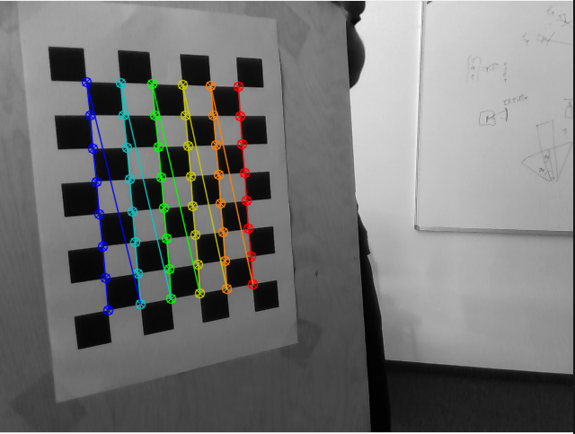
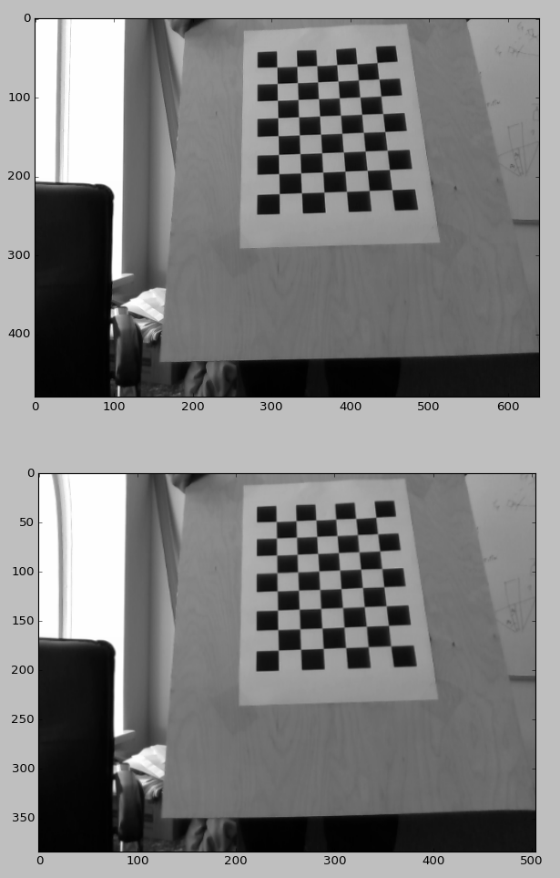

 **Author**

- Hamed Jafarzadeh - Hamed.Jafarzadeh@Skoltech.ru
- Skolkovo Institue of science and technology - [Mobile Robotics Lab](<http://sites.skoltech.ru/mobilerobotics/>)
- Under supervision of [Dr. Gonzalo Ferrer](<https://faculty.skoltech.ru/people/gonzaloferrer>)

# Camera Calibration

Today’s cheap pinhole cameras introduces a lot of distortion to images. Two major distortions are radial distortion and tangential distortion.

Due to radial distortion, straight lines will appear curved. Its effect is more as we move away from the center of image. For example, one image is shown below, where two edges of a chess board are marked with red lines. But you can see that border is not a straight line and doesn’t match with the red line. All the expected straight lines are bulged out. Visit [Distortion (optics)](http://en.wikipedia.org/wiki/Distortion_(optics)) for more details.


#


You can find more details specially on theories behind algorithms on <https://opencv-python-tutroals.readthedocs.io/en/latest/py_tutorials/py_calib3d/py_calibration/py_calibration.html>.


# Calibration process

- I have used [This](<https://trojan03.github.io/#!/blog/4>) as a start point.
- For the Checker board you could use [this](http://wiki.ros.org/camera_calibration/Tutorials/StereoCalibration#Before_Starting) checkboards. I've used the 8x6 checkboard. However when you count the rectangles, you'll get 9x7, to be honest I don't know the reason yet. I checked several other checkboard and this is seems to be same in their checkboards though.
- I have record a bag file of myself, moving a checkboard around, you can refer to my [previous article](<https://hamedjafarzadeh.github.io/robotics/2019/05/04/Record-a-ROS-bag-file-of-Intel-Real-sense-D435.html>) on how to record a bag file.  Later I found that maybe this was a quick way, since a simple 2 min bag file, results in too many pictures that was troublesome for me to pick images from them. maybe you could use rqt_image_viewer instead.

- I faced following buffer issue while recording the bag file :

  `rosbag record buffer exceeded.  Dropping oldest queued message.` 

  so I decided to narrow recording topics to just pictures and I removed the point clouds.

  ``` bash
  rosbag record /rscamera/depth/image_rect_raw /rscamera/color/image_raw /rscamera/infra1/image_rect_raw /rscamera/infra2/image_rect_raw /rscamera/color/camera_info /rscamera/depth/camera_info /rscamera/extrinsics/depth_to_color /rscamera/extrinsics/depth_to_infra1 /rscamera/extrinsics/depth_to_infra
  ```

- After recording the files I have used the [Python code](#Converting-bag-file-to-png-files) to convert the bag to png file and finally I choose about 10 pictures of them representing different poses of checkerboard.

- After selecting the pictures. I put them in the same directory of the code and I've used the following code for getting calibration values :
- be aware that you have to use python 2.7 from ROS package

```python
import numpy as np
import cv2
import glob
from matplotlib import pyplot as plt #optional, for comparing the results

# termination criteria
criteria = (cv2.TERM_CRITERIA_EPS + cv2.TERM_CRITERIA_MAX_ITER, 30, 0.001)

# prepare object points for a 8x6 chess board
objp = np.zeros((6*8,3), np.float32)
objp[:,:2] = np.mgrid[0:8,0:6].T.reshape(-1,2)

# Arrays to store object points and image points from all the images.
objpoints = [] # 3d point in real world space
imgpoints = [] # 2d points in image plane.

images = glob.glob('*.png')
gray = np.zeros((100,100,3), np.uint8)
for fname in images:
    img = cv2.imread(fname)
    gray = cv2.cvtColor(img,cv2.COLOR_BGR2GRAY)

    # Find the chess board corners
    ret, corners = cv2.findChessboardCorners(gray, (8,6),None)

    # If found, add object points, image points (after refining them)
    if ret == True:
        objpoints.append(objp)

        corners2 = cv2.cornerSubPix(gray,corners,(11,11),(-1,-1),criteria)
        imgpoints.append(corners2)

        # Draw and display the corners
        img = cv2.drawChessboardCorners(img, (8,6), corners2,ret)
        cv2.imshow('img',img)
        cv2.waitKey(500)

cv2.destroyAllWindows()

ret, mtx, dist, rvecs, tvecs = cv2.calibrateCamera(objpoints, imgpoints, gray.shape[::-1],None,None)
np.save('./calib', [mtx, dist, rvecs, tvecs])

```


- After you successfuly got the calibration values, you can include these lines at the end of the code to visually examine the differences. However in my case, my D435 seems perfectly calibrated and I can't see any difference visually.

```python

for fname in images:
    img = cv2.imread(fname)
    gray = cv2.cvtColor(img,cv2.COLOR_BGR2GRAY)

    h,  w = gray.shape[:2]
    newcameramtx, roi=cv2.getOptimalNewCameraMatrix(mtx,dist,(w,h),1,(w,h))

    # undistort
    dst = cv2.undistort(img, mtx, dist, None, newcameramtx)

    # crop the image
    x,y,w,h = roi
    dst = dst[y:y+h, x:x+w]
    plt.subplot(2,1,1)
    plt.imshow(img)
    plt.subplot(2,1,2)
    plt.imshow(dst)
    plt.waitforbuttonpress()
    plt.pause(0.001)

```



# Converting bag file to png files

I used the following script from [here](<https://gist.github.com/wngreene/835cda68ddd9c5416defce876a4d7dd9>).

  ```python
  #!/usr/bin/env python
  # -*- coding: utf-8 -*-
  
  # Copyright 2016 Massachusetts Institute of Technology
  
  """Extract images from a rosbag.
  """
  
  import os
  import argparse
  
  import cv2
  
  import rosbag
  from sensor_msgs.msg import Image
  from cv_bridge import CvBridge
  
  def main():
      """Extract a folder of images from a rosbag.
      """
      parser = argparse.ArgumentParser(description="Extract images from a ROS bag.")
      parser.add_argument("bag_file", help="Input ROS bag.")
      parser.add_argument("output_dir", help="Output directory.")
      parser.add_argument("image_topic", help="Image topic.")
  
      args = parser.parse_args()
  
      print "Extract images from %s on topic %s into %s" % (args.bag_file,
                                                            args.image_topic, args.output_dir)
  
      bag = rosbag.Bag(args.bag_file, "r")
      bridge = CvBridge()
      count = 0
      for topic, msg, t in bag.read_messages(topics=[args.image_topic]):
          cv_img = bridge.imgmsg_to_cv2(msg, desired_encoding="passthrough")
          
          cv2.imwrite(os.path.join(args.output_dir, "frame%06i.png" % count), cv_img)
          print "Wrote image %i" % count
  
          count += 1
  
      bag.close()
  
      return
  
  if __name__ == '__main__':
      main()
  ```

- and I run it with following command

  `python bagtoimg.py Checkboard.bag ./imgs/ /rscamera/color/image_raw`

- Then I selected about 10 of them.